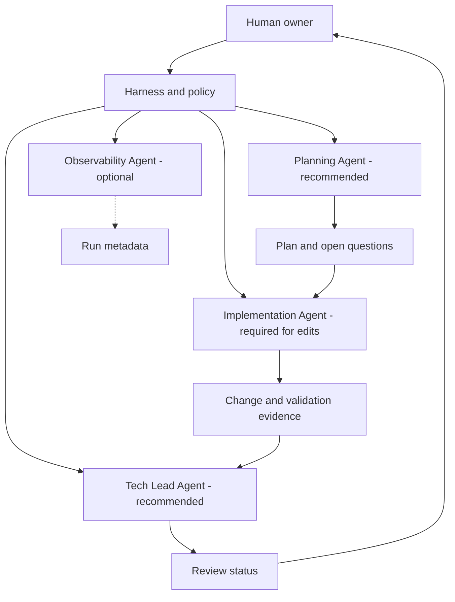

# Agent Model

## Classification

CORE role boundaries; separate agents are configurable.

The roles below describe responsibilities, not a requirement to deploy four independent agents. A project may combine planning and implementation for low-risk tasks while preserving independent review where policy requires it.

| Role | Classification | Responsibility | Inputs | Outputs | Default permissions |
| --- | --- | --- | --- | --- | --- |
| Planning Agent | RECOMMENDED | Understand request, locate relevant context, expose ambiguity/risk, and prepare a scoped plan. | Request, instructions, SDD, architecture, relevant code/tests. | Plan, assumptions, open questions, verification criteria. | READ. No writes or privileged actions. |
| Implementation Agent | REQUIRED when AI edits files | Implement an approved scope, use relevant skills/tools, validate, and report. | Approved request/spec/plan, architecture, selected context, tool grants. | Scoped changes, validation evidence, limitations. | READ and task-scoped WRITE; privileged access denied by default. |
| Tech Lead Agent | RECOMMENDED; policy-required for high-impact work | Independently assess specification compliance, architecture, tests, security, risk, and DoD. | Requirements, plan, diff, tests, validation evidence, policies. | Structured findings and one of four review statuses. | READ-only. Cannot modify reviewed work. |
| Observability Agent | OPTIONAL | Aggregate AI execution health, token/context use, tool activity, corrections, review outcomes, and interventions. | Run events and approved metrics metadata. | Dashboards, alerts, evaluation summaries. | READ telemetry only; no prompt/content access by default. |

## Shared Role Contract

Every configured agent should declare mission, owner, allowed inputs/data classifications, output format, allowed tools, permissions, restrictions, validation expectations, and escalation criteria. A role name or prompt does not itself enforce those permissions.

## Agent Hierarchy Diagram

See [Tech Lead Review](../governance/tech-lead-review.md) and [AI Observability](../observability/ai-observability.md).
