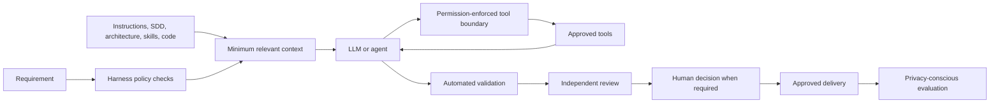

# AI Engineering Harness

## Classification

CORE TEMPLATE

## LLM / Agent

The model or agent interprets the task, reasons over supplied context, and proposes or performs actions granted by the harness. It can be uncertain, wrong, or vulnerable to untrusted input.

## Harness

The harness is the surrounding control system. It resolves instructions, selects context, grants tools, enforces permissions, identifies run boundaries, triggers validation and review, limits correction attempts, routes human decisions, and records auditable metadata.

Prompts alone are not a security boundary. Tool permissions, filesystem/network access, production access, and approval gates must be enforced outside the model where practical.

## CORE Control Flow

Request → Policy check → Context assembly → Plan → Authorized execution → Deterministic validation → Independent review when required → Human approval when required → Delivery → Evaluation.

Every stage should have an owner, input/output contract, failure behavior, and evidence record. Small low-risk changes may combine stages, but must retain policy and honest validation.

## CORE Controls

- Resolve applicable instructions and identify conflicts before acting.
- Use minimum-relevant, provenance-aware context.
- Isolate credentials and privileged operations from model-visible content.
- Bind tool grants to role, task, scope, and duration.
- Treat retrieval and tool output as untrusted data.
- Keep implementation and independent review distinct for high-impact work.
- Enforce configurable correction limits and human escalation.
- Record outcomes without retaining full prompts or sensitive payloads by default.

## OPTIONAL Controls

Multi-agent orchestration, MCP, RAG, model routing, policy engines, AI evaluation pipelines, and token-cost dashboards are optional layers. They add operational and security costs and should not be introduced merely because they are available.

