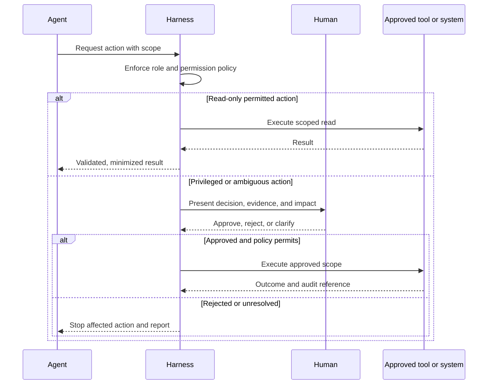

# Human in the Loop

**Classification: CORE for reserved, high-impact, and uncertain decisions.**

Agents can gather evidence and recommend actions, but delegated authority must be explicit. Human approval is mandatory when project policy or the triggers below apply. A user request does not override security policy or grant an unavailable tool permission.

## Mandatory Approval Triggers

- Production deployment, rollback, or a release exception.
- Security exception, authorization-policy change, or access expansion.
- Architecture boundary, data ownership, technology, or high-impact infrastructure change.
- Destructive, irreversible, or externally visible operation.
- Credential/secret creation, rotation, disclosure, or permission changes.
- Production or restricted-data access.
- Ambiguous, incomplete, or conflicting specifications or acceptance criteria.
- Agent uncertainty, low confidence, insufficient context, or a correction-attempt limit reached.
- Any decision that requires business risk acceptance or accountable domain authority.

## Approval Request

Provide the action and scope, reason approval is needed, evidence and alternatives, expected impact, reversibility, safeguards, and accountable approver. Do not include secret values or unnecessary sensitive payloads. Record approve/reject/clarify and the resulting scope.

## Human Decision Flow

## Escalation Status

Use `HUMAN_REVIEW_REQUIRED` when human authority or missing context blocks a reliable decision. Pause the affected operation. Continue unrelated safe work only when it cannot prejudge or bypass the pending decision.
