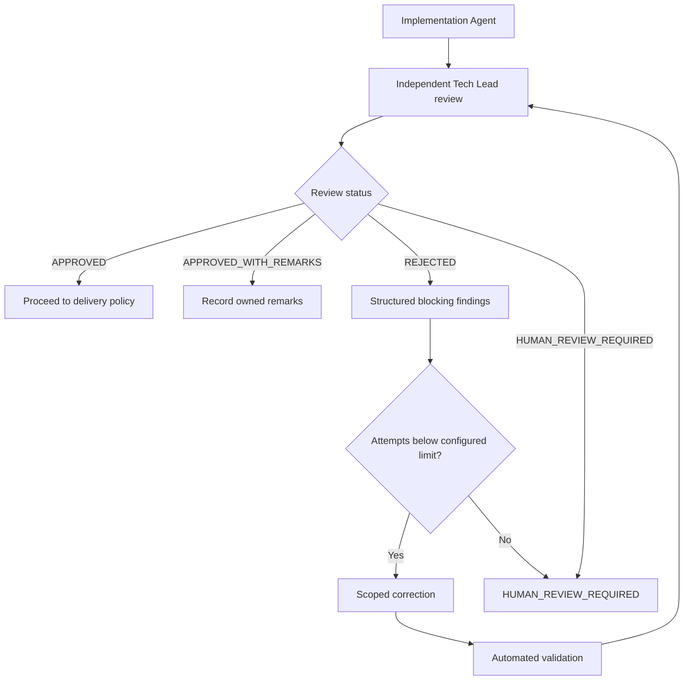

# Tech Lead Review

**Classification: RECOMMENDED; require by project policy for high-impact or security-sensitive changes.**

The Tech Lead Agent is an independent reviewer, not an implementation agent. It compares the approved specification and plan with the diff, architecture rules, tests, security controls, operational expectations, and Definition of Done. It must cite evidence, identify unknowns, and avoid inventing requirements.

## Review Statuses

| Status | Objective criteria |
| --- | --- |
| `APPROVED` | Requirements and acceptance criteria are met; required architecture, tests, security, and DoD checks pass; no blocking or material non-blocking findings remain. |
| `APPROVED_WITH_REMARKS` | All required checks pass and no blocking finding remains; only non-blocking improvements remain, each with impact and follow-up owner/status. |
| `REJECTED` | At least one verified blocking requirement failure, prohibited architecture violation, required validation failure, security violation, data-integrity risk, or incomplete mandatory DoD item requires correction. |
| `HUMAN_REVIEW_REQUIRED` | A reliable technical decision is impossible without human authority or context: ambiguous/conflicting requirements, security exception, high-impact architecture/infrastructure choice, business decision, insufficient evidence, or low confidence. |

## Decision Order

1. If authority, requirements, or evidence are materially ambiguous, return `HUMAN_REVIEW_REQUIRED` for the unresolved decision.
2. Otherwise, if a blocking finding or mandatory failed check exists, return `REJECTED`.
3. Otherwise, if only non-blocking findings remain and required checks pass, return `APPROVED_WITH_REMARKS`.
4. Otherwise, return `APPROVED`.

`HUMAN_REVIEW_REQUIRED` is an escalation, not an inferred approval or rejection. A human may resolve the open question and request a fresh review.

## Evidence and Finding Format

The review should include scope and sources reviewed, validation commands/outcomes, requirements traceability, security and architecture assessment, unresolved risks, and final status. Each finding should contain:

- stable finding ID and severity;
- category and affected requirement/rule;
- evidence and location;
- impact and reproducibility;
- required corrective action or human decision;
- blocking status and validation needed to close it.

Do not claim tests or scans passed unless the evidence is available. Distinguish absent evidence from a proven failure.

## Correction Loop

## Bounded Self-Correction

Configure `MAX_AGENT_CORRECTION_ATTEMPTS` as a positive project-specific limit. Each attempt must address structured findings, run applicable validation, and receive a new independent review. When the limit is reached, or progress is not converging, stop autonomous corrections and set `HUMAN_REVIEW_REQUIRED`. If the variable is unset or invalid, default to no autonomous retry. Never allow an unlimited loop.
