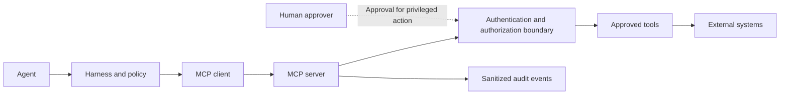

# MCP Strategy

**Classification: OPTIONAL.**

The Model Context Protocol (MCP) can standardize how a harness discovers and invokes tools or supplies contextual resources. MCP is a transport and capability-discovery mechanism, not an authorization grant, security boundary, or reason to expose every system to an agent.

## When to Use MCP

Use MCP when multiple agents/clients need a consistent tool interface, tool discovery or resource semantics provide real value, and the team can operate and secure the server boundary. Prefer a direct integration for one small, stable, single-client interaction when a protocol server adds needless operational complexity.

## Generic Architecture

## Responsibilities

- **MCP client:** Connect only to approved servers; expose discovered capabilities through the harness policy.
- **MCP server:** Publish a narrow set of tools/resources, validate inputs, enforce authorization, and return bounded results.
- **Harness:** Bind access to agent, user, task, scope, duration, data class, and operation; validate output and require approval where configured.
- **External tool:** Enforce its own identity and authorization checks; do not rely solely on the calling model.

## Security and Governance

- Authenticate server and client using approved mechanisms; never embed long-lived secrets in prompts or documents.
- Authorize every operation at the server and underlying system; default to read-only and least privilege.
- Separate read, write, and privileged tools; require configurable human approval for privileged actions.
- Validate schemas, size limits, destinations, and returned content; treat all output as untrusted.
- Log actor, operation category, scope, approval reference, and outcome without sensitive arguments.
- Apply rate limits, timeouts, cancellation, revocation, and server allowlisting.
- Review tool changes as security-sensitive API changes and test denial paths.

MCP discovery must not automatically enable an operation. The harness and server must each enforce allowed capabilities.
