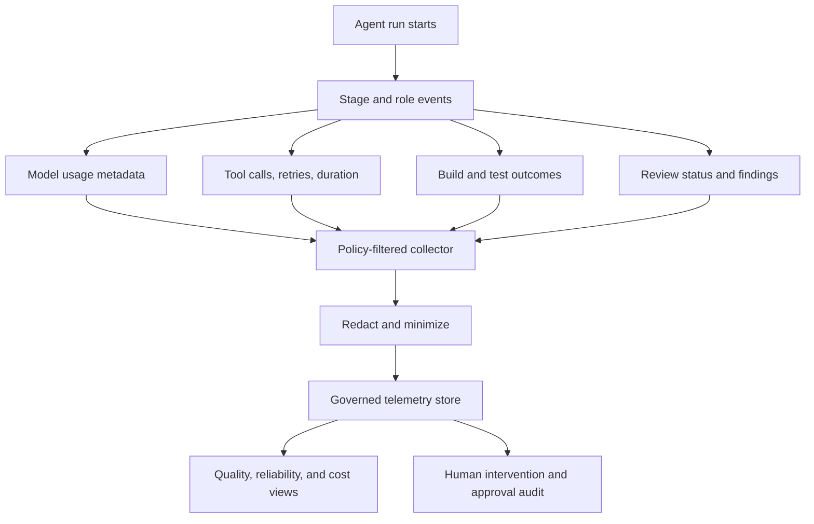

# AI Observability

**Classification: CORE privacy principle; dedicated observability agent/dashboard OPTIONAL.**

AI observability records execution metadata needed to diagnose quality, reliability, latency, and cost. Keep it distinct from application telemetry. A service trace does not prove model token use; token counts should come from an instrumented model interaction.

## Generic Execution Trace

Use an opaque `run_id` to correlate feature execution stages. Record stage start/end, role, outcome, duration, token counts when available, context-size metadata, tool-call categories and outcomes, retries, validation results, reviewer status/findings, correction attempt number, human intervention, and estimated cost with pricing-version provenance.

```text
Feature execution (opaque run_id)
├── Planning: duration, outcome, token usage when available
├── Context discovery: source categories, retrieval count, context size
├── Architecture analysis: risks, decisions requested
├── Implementation: duration, token usage, scoped tool calls
├── Validation: build, test, architecture, and security outcomes
├── Tech Lead review: status, findings by severity
├── Corrections: bounded attempt number and outcome
└── Final: total duration, token usage, estimated cost, human intervention
```

## Observability Flow



## Privacy and Reliability

- Do not retain complete prompts, completions, source diffs, or tool arguments by default.
- Store only approved data classes; pseudonymize user identity where possible.
- Use low-cardinality dimensions and separate operational metadata from content.
- Define role-based access, retention, deletion, export, and incident procedures.
- Record missing or estimated provider usage explicitly; never fabricate counts.
- Protect telemetry from becoming a secondary source of sensitive project data.

## Project Configuration

Define which events are collected, the approved provider usage fields, retention period, cost attribution rules, alert owners, and data access roles. Targets belong to the project; this template sets no universal thresholds.
