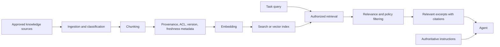

# RAG Strategy

**Classification: OPTIONAL.**

Retrieval-Augmented Generation (RAG) retrieves relevant knowledge for a task when static context is too large, changes frequently, or requires search across a governed corpus. RAG supplies evidence, not authority.

## Instructions Versus Knowledge

| Category | Examples | Authority |
| --- | --- | --- |
| Instructions | `AGENT.md`, security policies, approved architecture constraints, tool permissions. | Rules the agent MUST follow. Never replace these with retrieved text. |
| Knowledge | Documentation, domain references, approved technical materials, historical decisions. | Information the agent may retrieve and cite when relevant. Verify freshness and status. |

Accepted ADRs may inform a decision; rejected, superseded, or proposed records must retain their status. Historical content is not automatically current policy.

## Generic RAG Flow

## Design Requirements

- Define corpus owners, allowed data classes, ingestion sources, freshness, retention, and deletion.
- Preserve source, version, status, timestamp, and access-control metadata for each chunk.
- Enforce source ACLs before ranking and before exposing content to a model.
- Use retrieval quality checks and cite retrieved evidence; expose uncertainty when evidence is weak or conflicting.
- Defend against embedded prompt instructions, poisoning, stale content, and cross-tenant leakage.
- Keep secrets and unnecessary personal/production data out of embeddings and indexes.
- Evaluate precision, recall, freshness, authorization, and injection resilience against synthetic tasks.

Do not use a vector store merely because it is available. A small, curated static context or direct search may be simpler and safer.
