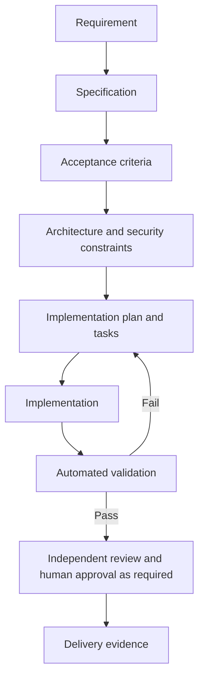

# Specification-Driven Development

**Classification: CORE for non-trivial changes.**

SDD connects an approved requirement to an implementation plan and verifiable outcome. It does not require large documents for every task. Scale detail to risk, uncertainty, and cross-boundary impact.

## Lifecycle

Requirement → Specification → Acceptance Criteria → Architecture Constraints → Implementation Plan → Implementation → Validation.

## Artifacts

- [Feature specification template](feature-spec-template.md): problem, scope, requirements, constraints, and open questions.
- [Requirements template](requirements-template.md): functional and non-functional requirements with traceable IDs.
- [Acceptance criteria template](acceptance-criteria-template.md): observable, testable outcomes and negative cases.
- [Architecture constraints template](architecture-constraints-template.md): boundaries, security, data, and operational rules.
- [Implementation plan template](implementation-plan-template.md): ordered tasks, risks, decisions, and verification.

## Authoritative Status

Mark each artifact `DRAFT`, `IN_REVIEW`, `APPROVED`, or `SUPERSEDED`. Identify the accountable human owner. An agent-generated specification remains a draft until the project's approval policy says otherwise.

## Minimal Change Path

For a low-risk, local change, record the requirement, acceptance check, impacted owner, and focused validation in the task itself. For cross-module, externally visible, security-sensitive, or irreversible changes, use the full artifacts and resolve material questions before implementation.
